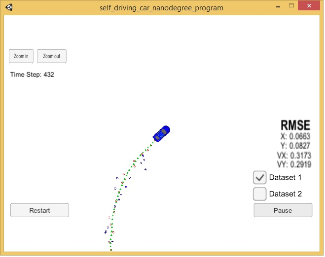
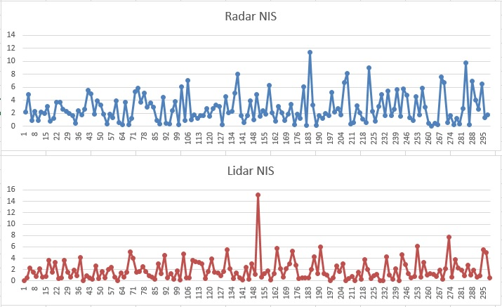

# Unscented Kalman Filter Project
Self-Driving Car Engineer Nanodegree Program

In this project I implemented an Unscented Kalman Filter to estimate the state of a moving object of interest with noisy lidar and radar measurements. RMSE values  are lower that the tolerance outlined in the project reburic. 

INPUT: values provided by the simulator to the c++ program

["sensor_measurement"] => the measurment that the simulator observed (either lidar or radar)

OUTPUT: values provided by the c++ program to the simulator

["estimate_x"] <= kalman filter estimated position x
["estimate_y"] <= kalman filter estimated position y
["rmse_x"]
["rmse_y"]
["rmse_vx"]
["rmse_vy"]

---

## Basic Build Instructions

1. Clone this repo.
2. Make a build directory: `mkdir build && cd build`
2b. Unzip src\Eigen.zip
3. Compile: `cmake .. && make`
4. Run it: `./UnscentedKF` Previous versions use i/o from text files.  The current state uses i/o
from the simulator.

## Algorithm Implementation Flow

1. Sensor Fusion algorithm follows the general processing flow
2. Algorithm uses the first measurements to initialize the state vectors and covariance matrices.
3. Upon receiving a measurement after the first, the algorithm will predict object position to the current timestep and then update the prediction using the new measurement.
4. Kalman Filter can handle radar and lidar measurements: Algorithm sets up the appropriate matrices given the type of measurement and calls the correct measurement function for a given sensor type

## Accuracy
Algorithm was run against Dataset 1 in the simulator which is the same as "data/obj_pose-laser-radar-synthetic-input.txt" in the repository. px, py, vx, vy output coordinates have an RMSE <= [.09, .10, .40, .30] when using the file as shown below:

The NIS was measured for RADAR and LIDAR and the sample of the NIS is ploted below:

